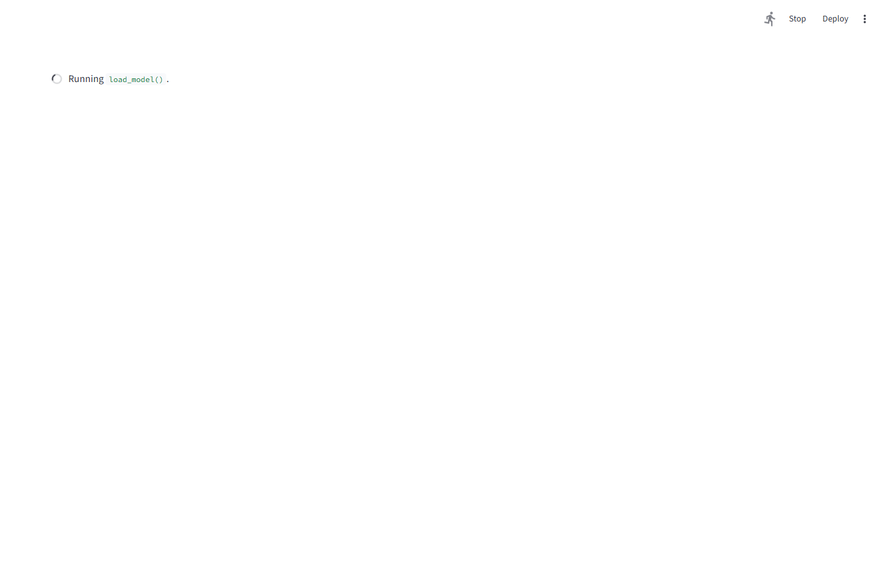
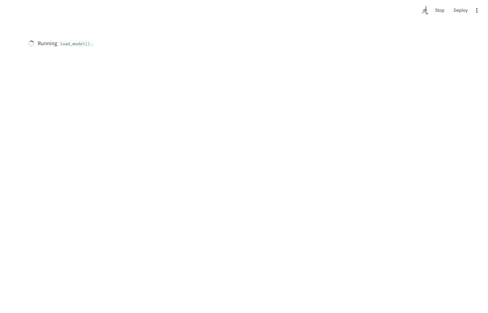
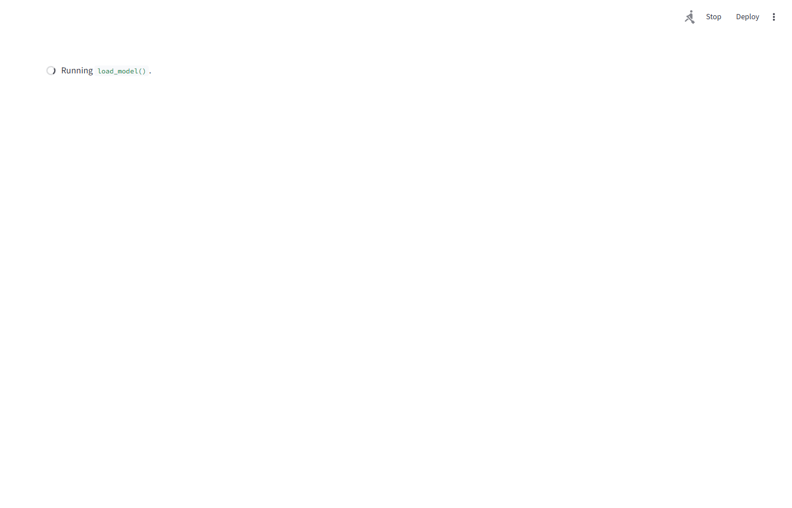
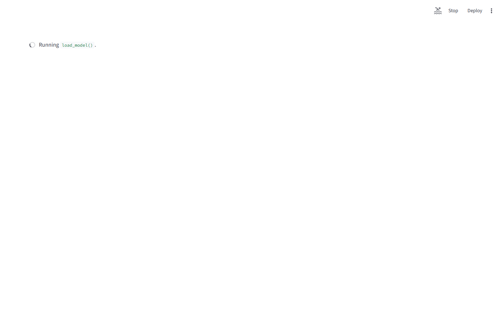

# House Price Prediction

A complete machine learning project for predicting house prices using the California Housing dataset.


## Features

### Data Analysis
- Exploratory Data Analysis (EDA) with interactive visualizations
- Correlation heatmaps and feature analysis
- Geographic price distribution maps
- Missing value handling and data cleaning

### Machine Learning Models
- Random Forest
- Gradient Boosting
- Cross-validation with 5-fold CV
- Automatic best model selection

### Feature Engineering
- Rooms per household
- Bedrooms per room ratio
- Population per household
- Income bracket categorization

### Model Evaluation
- R² Score, RMSE, MAE metrics
- Cross-validation scores with standard deviation
- Feature importance analysis

### Interactive Dashboard
- **Data Explorer** - Filter and visualize housing data
- **Predict Price** - Single property price prediction
- **Batch Prediction** - Upload CSV for bulk predictions with download
- **Model Insights** - Compare models and view feature importance
- Sidebar with dataset info and model metrics
- Custom CSS styling

## Dashboard Screenshots

### Data Explorer
Browse and filter the California housing dataset with interactive charts.




### Predict Price
Adjust location, property details, and demographics to predict house prices in real-time.





### Batch Prediction
Upload a CSV file to get predictions for multiple properties at once, then download the results.


### Model Insights
Compare model performance, view feature correlations, and analyze statistics.




## Installation

```bash
pip install -r requirements.txt
```

## Usage

### Run the Dashboard
```bash
python -m streamlit run app.py
```

Then open **http://localhost:8501** in your browser.

### Run the Notebook
```bash
jupyter notebook HOUSE_PRICE_PREDICTION.ipynb
```

## Project Structure

```
├── housing.csv                    # California Housing dataset
├── HOUSE_PRICE_PREDICTION.ipynb   # Analysis & training notebook
├── app.py                         # Streamlit dashboard
├── requirements.txt               # Python dependencies
├── screenshots/                   # Dashboard screenshots
│   ├── 01_data_explorer.png
│   ├── 02_data_charts.png
│   ├── 03_predict_price.png
│   ├── 04_predict_inputs.png
│   ├── 05_batch_prediction.png
│   ├── 06_model_insights.png
│   └── 07_model_charts.png
├── best_house_price_model.pkl     # Trained model (auto-generated)
├── model_features.pkl             # Model metadata (auto-generated)
└── README.md
```

## How It Works

1. The app loads the housing dataset automatically
2. Missing values are handled (median imputation)
3. If no trained model exists, it trains Random Forest and Gradient Boosting on first launch
4. The best model is selected automatically based on R² score
5. Use the dashboard to explore data, make predictions, or upload batch CSVs

## Dashboard Tabs

| Tab | Description |
|-----|-------------|
| Data Explorer | Interactive data filtering, distributions, scatter plots |
| Predict Price | Adjust sliders and inputs to predict a single house price |
| Batch Prediction | Upload CSV file, get predictions, download results |
| Model Insights | Model comparison charts, feature correlations, statistics |

## Technologies

- Python 3.10+
- Pandas, NumPy
- Scikit-learn
- Streamlit, Plotly
- Joblib
